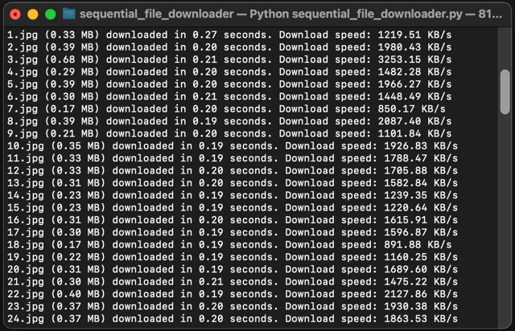

<h1 align="center" style="border-bottom: none">
    ⭐️ Sequential File Downloader ⭐️ <br>
    <p align="center">
        
    </p>
</h1>

A powerful and efficient Python tool for downloading sequential files in parallel. Perfect for downloading numbered files like images, documents, or any other sequential content.

<p align="center">
    <a href="README.md">English</a> •
    <a href="README_tr.md">Türkçe</a>
</p>

## 🚀 Features

- ⚡️ **Parallel Downloads**: Download multiple files simultaneously
- 📦 **Memory Efficient**: Smart batch processing to handle large sequences
- 🔄 **Auto Sequence**: Automatically generates sequential URLs
- 📊 **Progress Tracking**: Real-time progress bars for each download
- 💡 **Smart Detection**: Automatically detects when sequence ends
- 🛡️ **Error Handling**: Robust error management and recovery
- 📝 **Detailed Stats**: Download speed, size, and time statistics

## 💡 Use Case Example

Imagine you're browsing an e-book site and want to download a book. The site has images of the book, and you've copied the link to the first image:

```
https://example.com/book/page_1.jpg
https://example.com/book/page_2.jpg
https://example.com/book/page_3.jpg
...
```

Instead of downloading each image manually, Sequential File Downloader will handle everything automatically!

## 🔧 Installation

1. Clone the repository:
```bash
git clone https://github.com/yourusername/SequentialFileDownloader.git
cd SequentialFileDownloader
```

2. Install dependencies:
```bash
pip install -r requirements.txt
```

## 📖 Usage

1. Run the script:
```bash
python sequential_file_downloader.py
```

2. Enter the URL template when prompted
3. Choose download directory (optional)
4. Specify number of files (or press Enter for unlimited)

## ⚙️ Configuration

```python
downloader = FileDownloader(
    timeout=30,        # Connection timeout
    chunk_size=8192,   # Download chunk size
    max_workers=3,     # Parallel downloads
    batch_size=100     # Files per batch
)
```

## 🤝 Contributing

Contributions are welcome! Feel free to submit a Pull Request.

## 📝 License

This project is licensed under the MIT License - see the [LICENSE](LICENSE) file for details.
