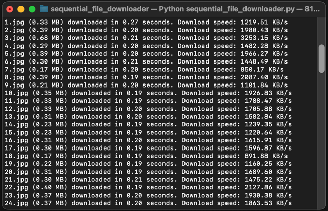

<h1 align="center" style="border-bottom: none">
    ⭐️ Sequential File Downloader ⭐️ <br>
    <p align="center">
        
    </p>
</h1>

Sıralı dosyaları paralel olarak indirmek için güçlü ve verimli bir Python aracı. Numaralandırılmış görseller, belgeler veya diğer sıralı içerikleri indirmek için mükemmel.

<p align="center">
    <a href="README.md">English</a> •
    <a href="README_tr.md">Türkçe</a>
</p>

## 🚀 Özellikler

- ⚡️ **Paralel İndirme**: Birden fazla dosyayı aynı anda indir
- 📦 **Bellek Dostu**: Akıllı grup işleme ile büyük serileri yönet
- 🔄 **Otomatik Sıralama**: Sıralı URL'leri otomatik oluştur
- 📊 **İlerleme Takibi**: Her indirme için gerçek zamanlı ilerleme çubuğu
- 💡 **Akıllı Algılama**: Seri sonunu otomatik tespit
- 🛡️ **Hata Yönetimi**: Güçlü hata yönetimi ve kurtarma
- 📝 **Detaylı İstatistik**: İndirme hızı, boyut ve süre bilgisi

## 💡 Kullanım Senaryosu

Bir e-kitap sitesinde geziniyorsunuz ve bir kitap indirmek istiyorsunuz. Sitenin kitap sayfalarının görüntüleri var ve ilk görüntünün linkini kopyaladınız:

```
https://example.com/book/sayfa_1.jpg
https://example.com/book/sayfa_2.jpg
https://example.com/book/sayfa_3.jpg
...
```

Her görüntüyü tek tek indirmek yerine, Sequential File Downloader her şeyi otomatik olarak halledecek!

## 🔧 Kurulum

1. Repo'yu klonlayın:
```bash
git clone https://github.com/kullaniciadi/SequentialFileDownloader.git
cd SequentialFileDownloader
```

2. Gereksinimleri yükleyin:
```bash
pip install -r requirements.txt
```

## 📖 Kullanım

1. Scripti çalıştırın:
```bash
python sequential_file_downloader.py
```

2. İstendiğinde URL şablonunu girin
3. İndirme dizinini seçin (isteğe bağlı)
4. Dosya sayısını belirtin (veya sınırsız için Enter'a basın)

## ⚙️ Yapılandırma

```python
downloader = FileDownloader(
    timeout=30,        # Bağlantı zaman aşımı
    chunk_size=8192,   # İndirme parça boyutu
    max_workers=3,     # Paralel indirme sayısı
    batch_size=100     # Grup başına dosya sayısı
)
```

## 🤝 Katkıda Bulunma

Katkılarınızı bekliyoruz! Pull Request göndermekten çekinmeyin.

## 📝 Lisans

Bu proje MIT Lisansı ile lisanslanmıştır - detaylar için [LICENSE](LICENSE) dosyasına bakın.
